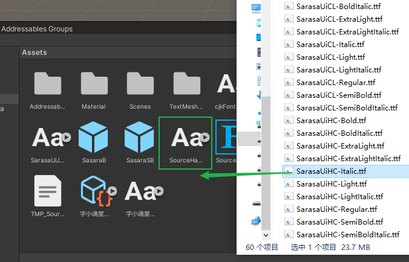
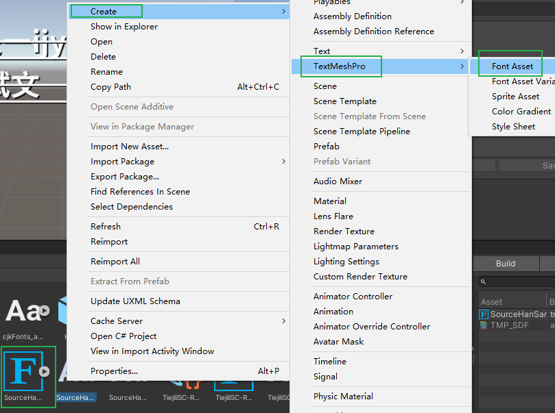
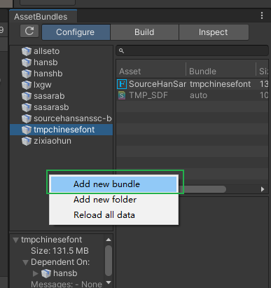
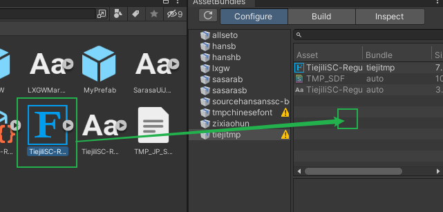
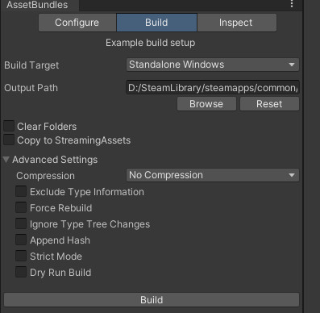
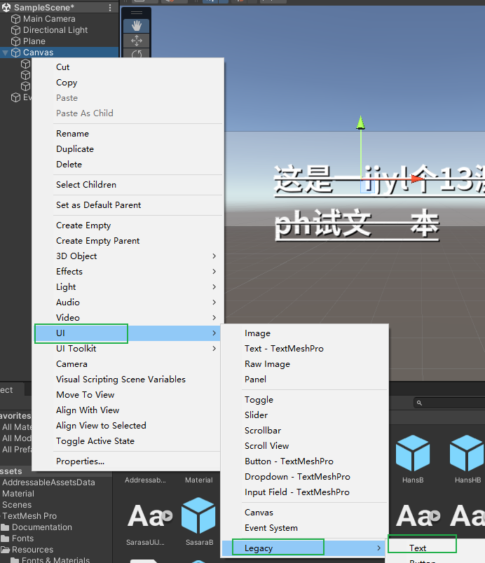
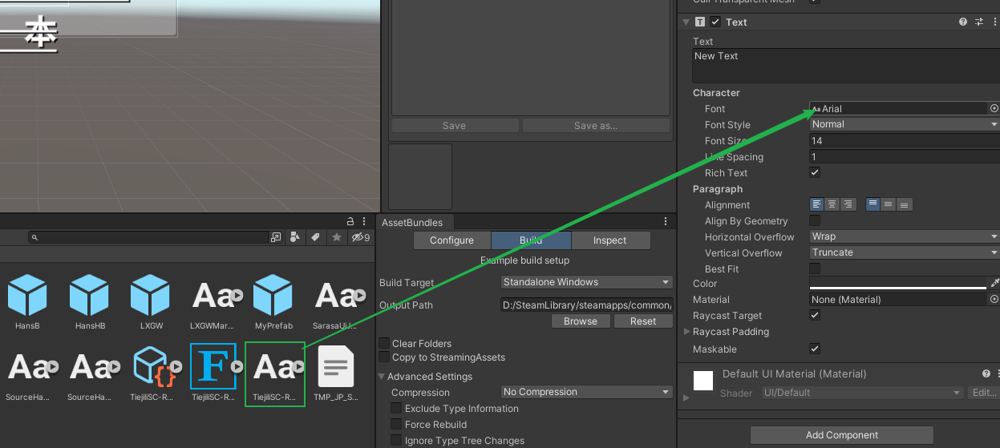
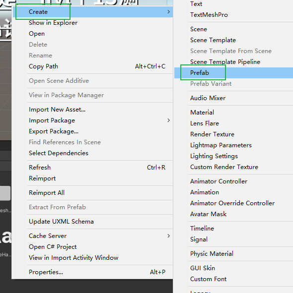
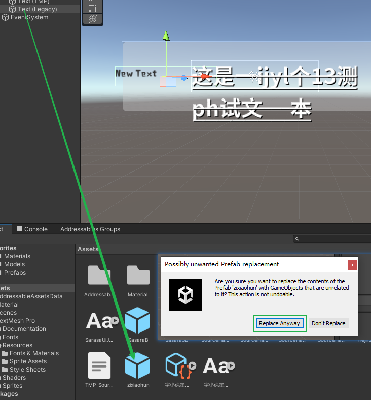
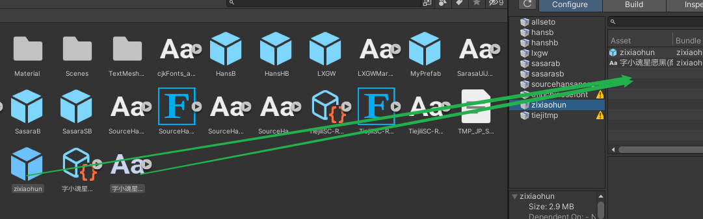

# [LLC_ChineseFontAsset](../../releases)

中文字体

*  你可以在[这里](https://pan.baidu.com/s/15--xdXrsExyvRVgXpyiDrA?pwd=t9r5 "提取码：t9r5")获取该字体的Unity项目包。碍于包体积较大，我将其上传到了外部的网盘。
*  其需要在Unity中安装TextMeshPro（进行TMP字体生成）及AssetBundleManager（将Unity资产打包为AB包）搭配进行使用。
*  若有字体生成及打包相关的疑问可联系我。

## 手动构建

0. 从 [这里](https://pan.baidu.com/s/15--xdXrsExyvRVgXpyiDrA?pwd=t9r5 "提取码：t9r5") 下载 Unity 工程，并使用 Unity 打开。一般而言没有版本上的限制，最好与实际要替换字体的游戏使用相同的版本。

### TMP (TextMeshPro)

1. 将要打包的字体拖入 unity 的 Asset 窗格中。拖入成功后将会多出一个与你拖入字体同名的字体，图标为 `Aa`。

2. 在那个字体上右键，选择菜单中的 `Create->TextMeshPro->Font Asset` 基于这个字体创建 `Font Asset`。被创建出来的 `Font Asset` 图标会显示为 `F`。

3. 选择 AssetBundles 窗格（如果不小心关闭了，可以从 `Window->AssetBundle Browser` 菜单调出） 的 `Configure` 栏。在左侧列表按下右键弹出菜单，选择 `Add new bundle` 创建新的 AB 包，取名为你想要的名字。

4. 选择你新建的 AB 包，将刚才新建出的 `Font Bundle` 拖进右侧的窗格，即便有警告也可以不用管。

5. 切换到 `Build` 栏，在 `Output Path` 中选择你要保存到的路径，最后按下 `Build`，稍等片刻即可在 `Output Path` 看到打包好的文件。


### Unity 老 UI(UnityEngine.Font)

1. 将要打包的字体拖入 unity 的 Asset 窗格中。拖入成功后将会多出一个与你拖入字体同名的字体，图标为 `Aa`。

2. 在当前Scene中创建一个 `UI->Legacy->Text` 组件。

3. 将要打包的字体拖动到新建的 `Text` 组件的 `Font` 属性上。

4. 在 `Asset` 栏新建一个 `Create->Prefab`。

5. 将 2. 创建的 `Text` 组件拖动到 4. 创建的 `Prefab` 上，会弹出是否替换相关的提示，选择 `Replace Anyway`

6. 选择 AssetBundles 窗格（如果不小心关闭了，可以从 `Window->AssetBundle Browser` 菜单调出） 的 `Configure` 栏。在左侧列表按下右键弹出菜单，选择 `Add new bundle` 创建新的 AB 包，取名为你想要的名字。

7. 将 1. 中拖入的字体，和 4. 中创建的 `Prefab` ，都拖入右侧的窗格。

5. 切换到 `Build` 栏，在 `Output Path` 中选择你要保存到的路径，最后按下 `Build`，稍等片刻即可在 `Output Path` 看到打包好的文件。


## 如何使用

要在代码中使用上面导入的文本，需要在代码中对合适的函数进行 Hook。下面给出对于 `TMP` 和 `UnityEngine.UI.Text` 的范例：

### TMP
这个范例来自 LocalizeLimbusCompany & DungeonArtifactTrans
```csharp
        //略
        // From https://github.com/LocalizeLimbusCompany/LocalizeLimbusCompany
        public static List<TMP_FontAsset> tmpchinesefonts = new List<TMP_FontAsset>();
        public static List<string> tmpchinesefontnames = new List<string>();
        #region 字体
        public static bool AddChineseFont(string path)
        {
            if (File.Exists(path))
            {
                var AllAssets = AssetBundle.LoadFromFile(path).LoadAllAssets();
                foreach (var Asset in AllAssets)
                {
                    var TryCastFontAsset = Asset as TMP_FontAsset;
                    if (TryCastFontAsset)
                    {
                        UnityEngine.Object.DontDestroyOnLoad(TryCastFontAsset);
                        TryCastFontAsset.hideFlags |= HideFlags.HideAndDontSave;
                        tmpchinesefonts.Add(TryCastFontAsset);
                        tmpchinesefontnames.Add(TryCastFontAsset.name);
                        return true;
                    }
                }
            }
            return false;
        }

        public static bool GetChineseFont(string fontname, out TMP_FontAsset fontAsset)
        {
            fontAsset = null;
            if (tmpchinesefonts.Count == 0)
                return false;
            if (fontname == "ZenAntique-Regular SDF" || fontname.StartsWith("HinaMincho-Regular") || fontname.StartsWith("HigashiOme-Gothic-C") || fontname == "Pretendard-Regular SDF" || fontname.StartsWith("SCDream") || fontname == "LiberationSans SDF" || fontname == "Mikodacs SDF" || fontname == "BebasKai SDF")
            {
                fontAsset = tmpchinesefonts[0];
                return true;
            }
            //if (fontname == "ZenAntique-Regular SDF" || fontname.StartsWith("HinaMincho-Regular") || fontname.StartsWith("HigashiOme-Gothic-C") || fontname == "Pretendard-Regular SDF" || fontname.StartsWith("SCDream") || fontname == "LiberationSans SDF" || fontname == "Mikodacs SDF" || fontname == "BebasKai SDF")
            return false;
        }

        static FieldInfo fi = null;
        public static TMP_FontAsset GetFontAsset(TMP_Text txt)
        {
            if (fi == null)
                fi = AccessTools.Field(typeof(TMP_Text), "m_fontAsset");
            if (fi != null)
                return fi.GetValue(txt) as TMP_FontAsset;
            return null;
        }

        public static bool IsChineseFont(TMP_FontAsset fontAsset)
            => tmpchinesefontnames.Contains(fontAsset.name);
        [HarmonyPatch(typeof(TMP_Text), nameof(TMP_Text.font), MethodType.Setter)]
        [HarmonyPrefix]
        private static bool set_font(TMP_Text __instance, ref TMP_FontAsset value)
        {
            if (IsChineseFont(GetFontAsset(__instance)))
                return false;
            string fontname = GetFontAsset(__instance).name;
            if (GetChineseFont(fontname, out TMP_FontAsset font))
                value = font;
            return true;
        }

        public static void Init()
        {
            var modPath = Path.GetDirectoryName(Assembly.GetExecutingAssembly().Location);
            var fontPath = Path.Join(modPath, "tmpchinesefont");
            if (!AddChineseFont(fontPath))
            {
                Logger.Log("You Not Have Chinese Font, Please Read GitHub Readme To Download\n你没有下载中文字体,请阅读GitHub的Readme下载");
            }
        }


        // From https://github.com/hxdnshx/DungeonArtifactLocalization
        [HarmonyPatch(typeof(TMP_Text), nameof(TMP_Text.text), MethodType.Setter)]
        [HarmonyPrefix]
        private static void set_text(TMP_Text __instance, ref Material value)
        {
            if (!IsChineseFont(GetFontAsset(__instance)))
            {
                string fontname = GetFontAsset(__instance).name;
                if (GetChineseFont(fontname, out TMP_FontAsset font))
                    __instance.font = font;
            }
        }
```

### UnityEngine.UI.Text(UguiNovelText 等)
这个范例来自 ReaperEmporiumTrans (尚未开源)

```csharp
    public static class FontRes
    {
        public static UnityEngine.Font FntYuruka = null;
        public static UnityEngine.Font FntNewRodinB = null;
        public static UnityEngine.Font FntNewRodinEB = null;
        public static UnityEngine.Font FntLXGW = null;

        public static UnityEngine.Font LoadFontFromAsset(string fileName)
        {
            var modPath = Path.GetDirectoryName(Assembly.GetExecutingAssembly().Location);
            var allAssets = AssetBundle.LoadFromFile(Path.Join(modPath, fileName));

            foreach (var asset in allAssets.LoadAllAssets())
            {
                Logger.Log($"Found type {asset} {asset.GetType()}");
                if (asset is UnityEngine.Font font)
                {
                    return font;
                }
            }

            return null;
        }

        public static void InitFont()
        {

            FntYuruka = LoadFontFromAsset("allseto");
            FntNewRodinEB = LoadFontFromAsset("hanshb");
            FntNewRodinB = LoadFontFromAsset("hansb");
            FntLXGW = LoadFontFromAsset("lxgw");
            if (FntYuruka != null)
            {
                Logger.Log($"Initialized Font {FntYuruka.name} {string.Join(",",FntYuruka.fontNames)}");
            }
            else
            {
                Logger.Log("Failed to Init Font");
            }
        }
    }

    //显示UI元素等场合，会至少调用一次这个方法。
    [HarmonyPatch(typeof(UguiNovelText), "Awake")]
    public class FontHooksAwake
    {
        //TT_Yuruka-UB
        public static void Postfix(UnityEngine.UI.Text __instance)
        {
            string fontName = __instance?.font?.name;
            switch (fontName)
            {
                case "TT_Yuruka-UB":
                {
                    if (FontRes.FntYuruka == null) FontRes.InitFont();
                    if (FontRes.FntLXGW != null)
                    {
                        __instance.font = FontRes.FntLXGW;
                        __instance.fontStyle = FontStyle.Bold;
                    }

                    break;
                }
                case "FOT-HummingStd-B":
                {
                    if (FontRes.FntYuruka == null) FontRes.InitFont();
                    if (FontRes.FntYuruka != null)
                    {
                        __instance.font = FontRes.FntYuruka;
                        //__instance.fontStyle = FontStyle.Bold;
                    }

                    break;
                }
                case "FOT-KurokaneStd-EB":
                {
                    if (FontRes.FntYuruka == null) FontRes.InitFont();
                    if (FontRes.FntLXGW != null)
                    {
                        __instance.font = FontRes.FntLXGW;
                        //__instance.fontStyle = FontStyle.Bold;
                    }

                    break;
                }
                case "FOT-NewRodinPro-EB":
                {
                    if (FontRes.FntYuruka == null) FontRes.InitFont();
                    if (FontRes.FntNewRodinEB != null)
                    {
                        __instance.font = FontRes.FntNewRodinEB;
                    }

                    break;
                }
                case "FOT-NewRodinPro-B":
                {
                    if (FontRes.FntYuruka == null) FontRes.InitFont();
                    if (FontRes.FntNewRodinB != null)
                    {
                        __instance.font = FontRes.FntNewRodinB;
                    }

                    break;
                }
                //对于替换的字体进行忽略
                case "LXGWMarkerGothic-Regular":
                case "SarasaUiJ-Bold":
                case "SarasaUiJ-SemiBold":
                case "SourceHanSansSC-Bold":
                case "SourceHanSansSC-Heavy":
                    break;
                default:
                {
                    if (!string.IsNullOrEmpty(fontName))
                    {
                        Logger.Log($"Unknown Font {fontName}");
                    }

                    break;
                }
            }
        }
    }
```